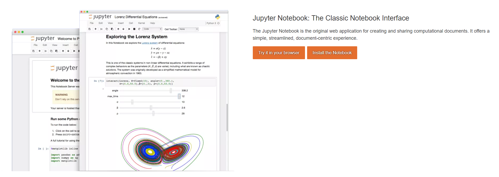
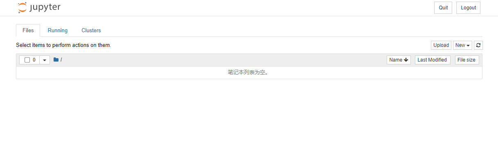
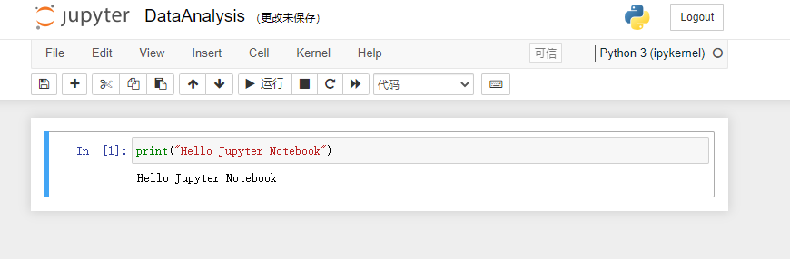
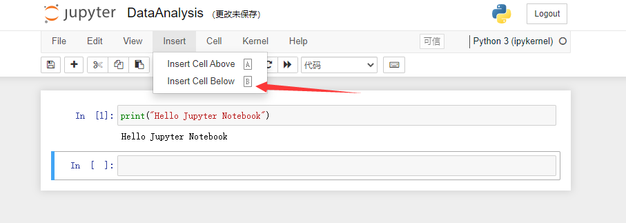
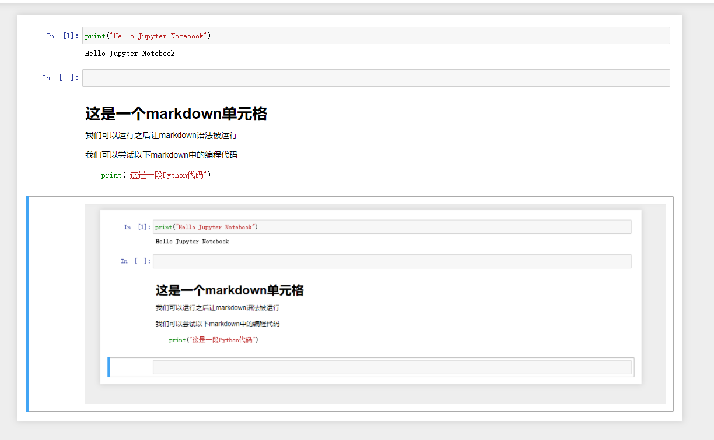

我们首先需要安装jupyter notebook：

[](https://github.com/YeJiu97/DataAnalysisNote/blob/main/JupyterNotebook/image/5o6xghkgs_.png)

接着我们需要创建一个文件夹，接着使用cmd，使用cd导入到该文件夹。

接着在cmd上输入：

```
jupyter notebook
```

我们会看到如下所示的一些界面：

[](https://github.com/YeJiu97/DataAnalysisNote/blob/main/JupyterNotebook/image/945xajli-m.png)

[](https://github.com/YeJiu97/DataAnalysisNote/blob/main/JupyterNotebook/image/ortzdskol0.png)

jupyter notebook相当于是一个使用浏览器的编译器，在运行的过程中我们不能够关闭CMD界面，否则程序会停止运行，如果我们想要停止运行，可以选择先点击QUIT按钮，然后关闭浏览器页面和CMD界面。

[](https://github.com/YeJiu97/DataAnalysisNote/blob/main/JupyterNotebook/image/s2gn-iobkm.png)

接着我们来创建一个Python 3的文件：

[](https://github.com/YeJiu97/DataAnalysisNote/blob/main/JupyterNotebook/image/mnv1nbac_t.png)

并且将其命名为：

[](https://github.com/YeJiu97/DataAnalysisNote/blob/main/JupyterNotebook/image/pwvua8y69c.png)

我们可以尝试着运行一行代码来试试看是否能够成功的运行：

[](https://github.com/YeJiu97/DataAnalysisNote/blob/main/JupyterNotebook/image/-qy-05-zr0.png)

运行的快捷键为：ctrl+enter。

我们可以在已有的单元格下面添加一个新的单元格：

[](https://github.com/YeJiu97/DataAnalysisNote/blob/main/JupyterNotebook/image/3zdk5f9d-r.png)

快捷键为B。

单元格也可以是别的格式的文本：

[](https://github.com/YeJiu97/DataAnalysisNote/blob/main/JupyterNotebook/image/0-x92xu3ef.png)

我们可以试一下markdown语法：

[](https://github.com/YeJiu97/DataAnalysisNote/blob/main/JupyterNotebook/image/z5s9wpse5_.png)

运行之后的结果为：

[](https://github.com/YeJiu97/DataAnalysisNote/blob/main/JupyterNotebook/image/56ml4txp4u.png)

我们可以直接将截图复制到markdown文件中，运行的结果为：

[](https://github.com/YeJiu97/DataAnalysisNote/blob/main/JupyterNotebook/image/m68kzqw146.png)
